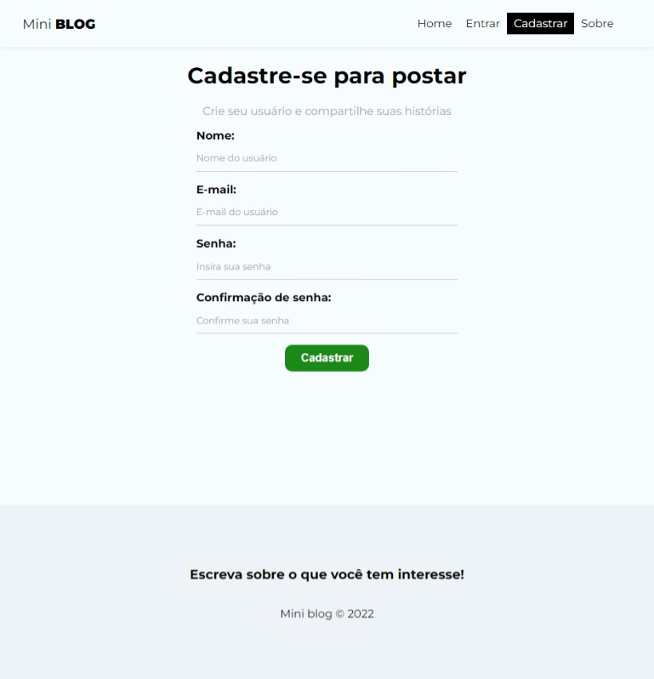
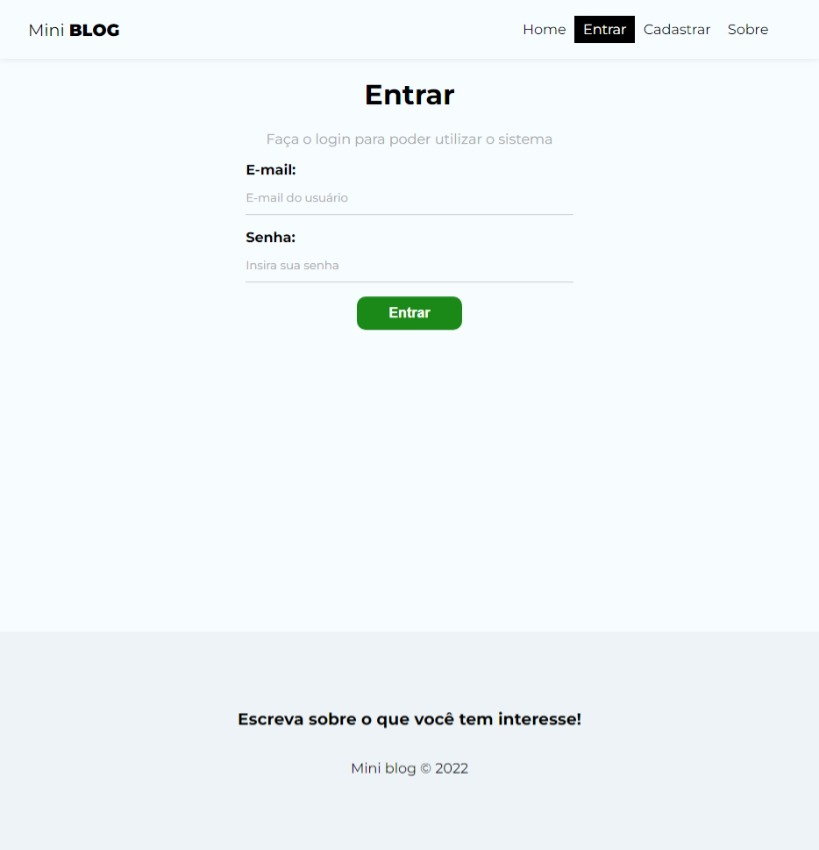
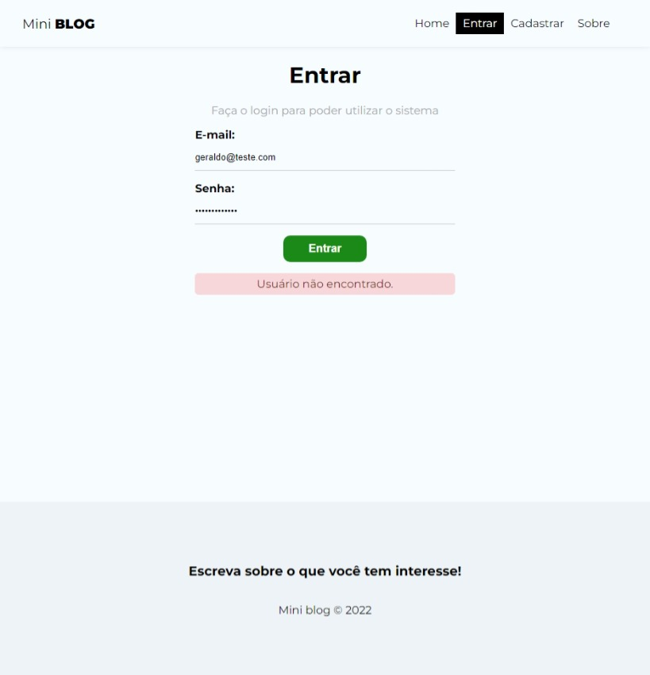
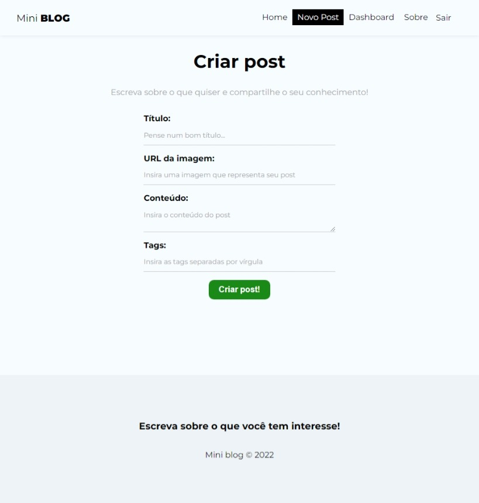
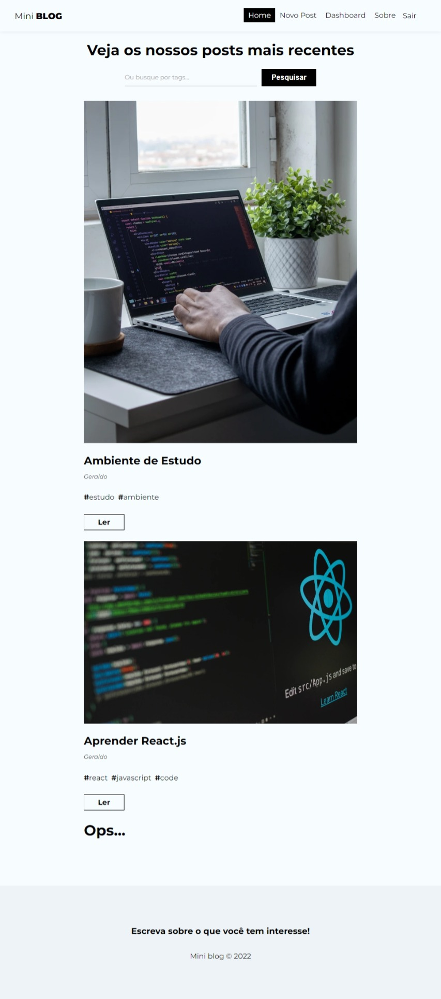
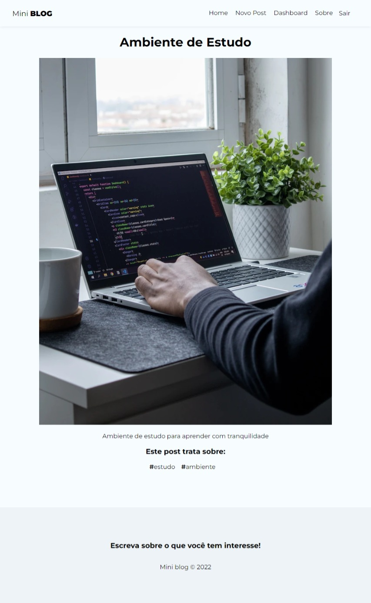
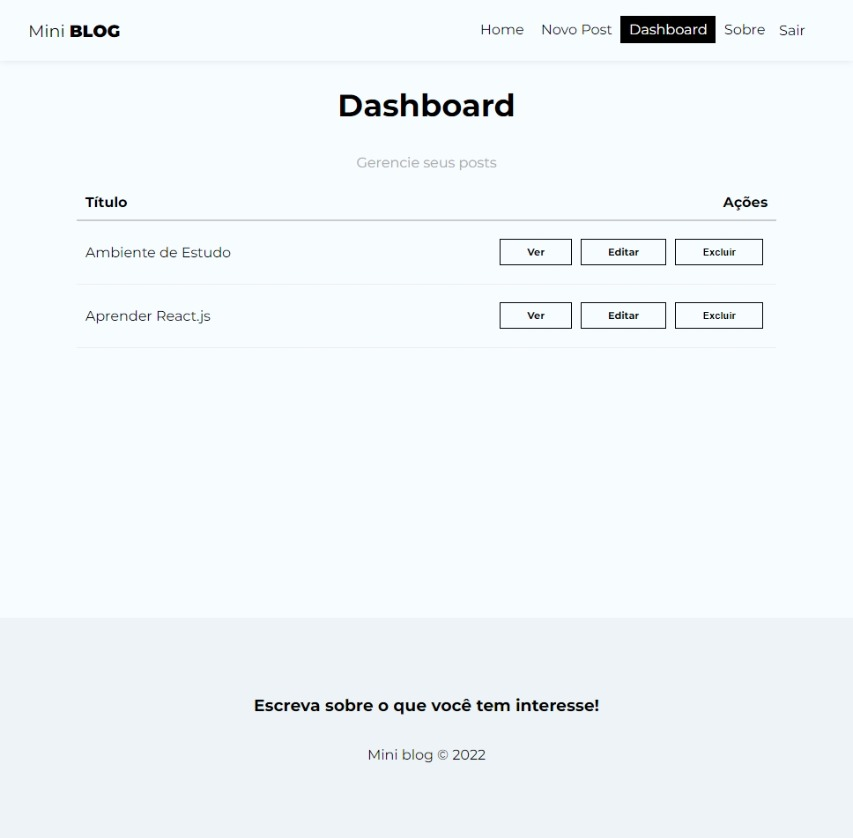
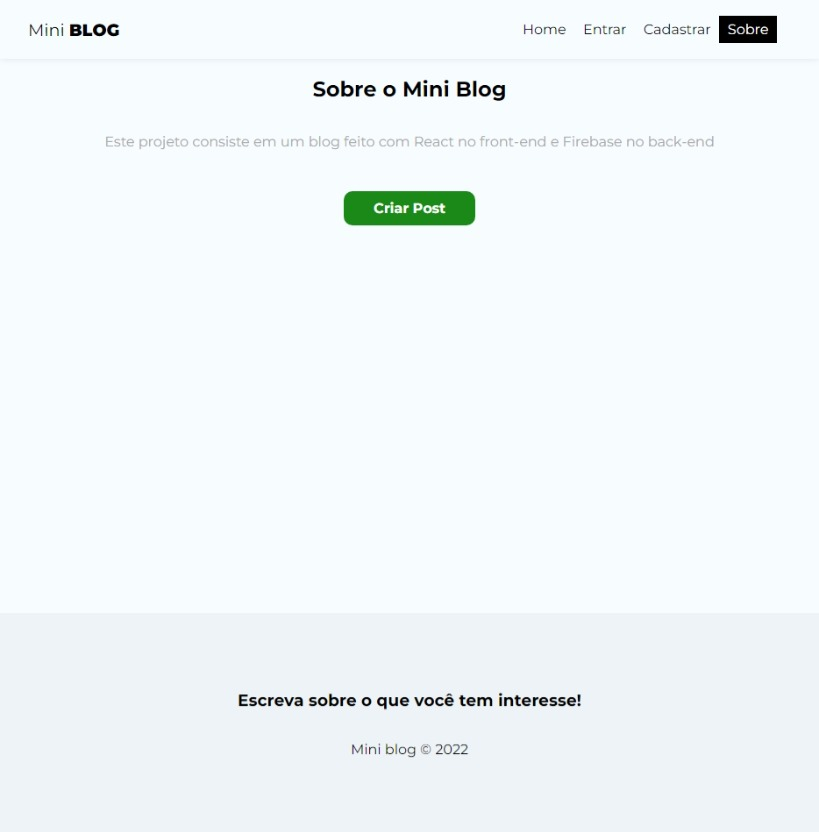

# Projeto 2 curso React.js da Udemy: Mini-Blog

## Mini blog feito em React.js com autenticação e banco de dados no firebase 
 
 

### **Cadastro de Usuário**

 
 
 

### **Login**

 
 
 

### **Exemplo de Verificação de Erro no Login**

 
 
 

### **Criação de Post**

 
 
 

### **Home**

 
 
 

### **View do Post**

 
 
 

### **Dashboard**

 
 
 

### **Sobre**

 
 
 

## Libs:
- npm i firebase
- npm i react-router-dom

## Instruções

`npm install` para instalar as dependências e `npm start` para inicializar o projeto
